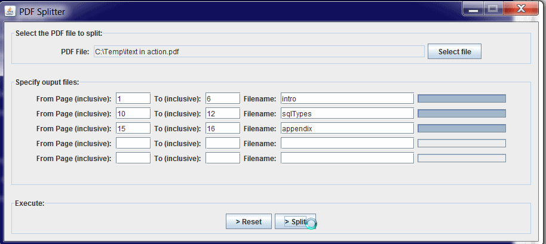
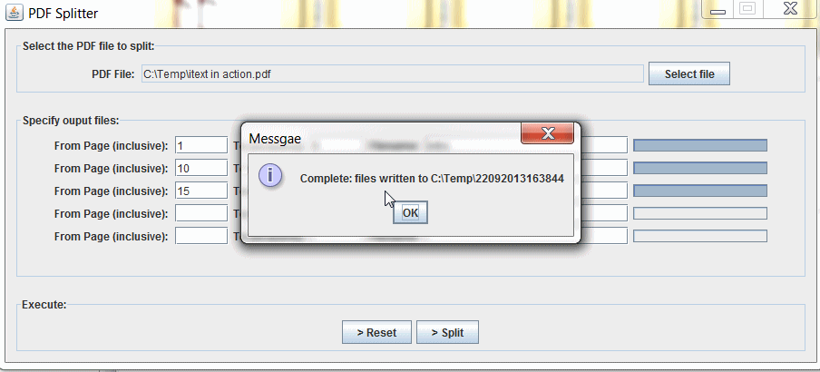

## PDF Splitter 

- A simple swing app, written in a single groovy script, to split a pdf document into individual documents.
- Newly created pdf's are placed into a new directory under the same directory as the selected pdf.
- Why? an experimnt with groovy's swing builder. 
- Requires groovy 1.8.6 or above
- To run: > groovy PdfSplitter.groovy

